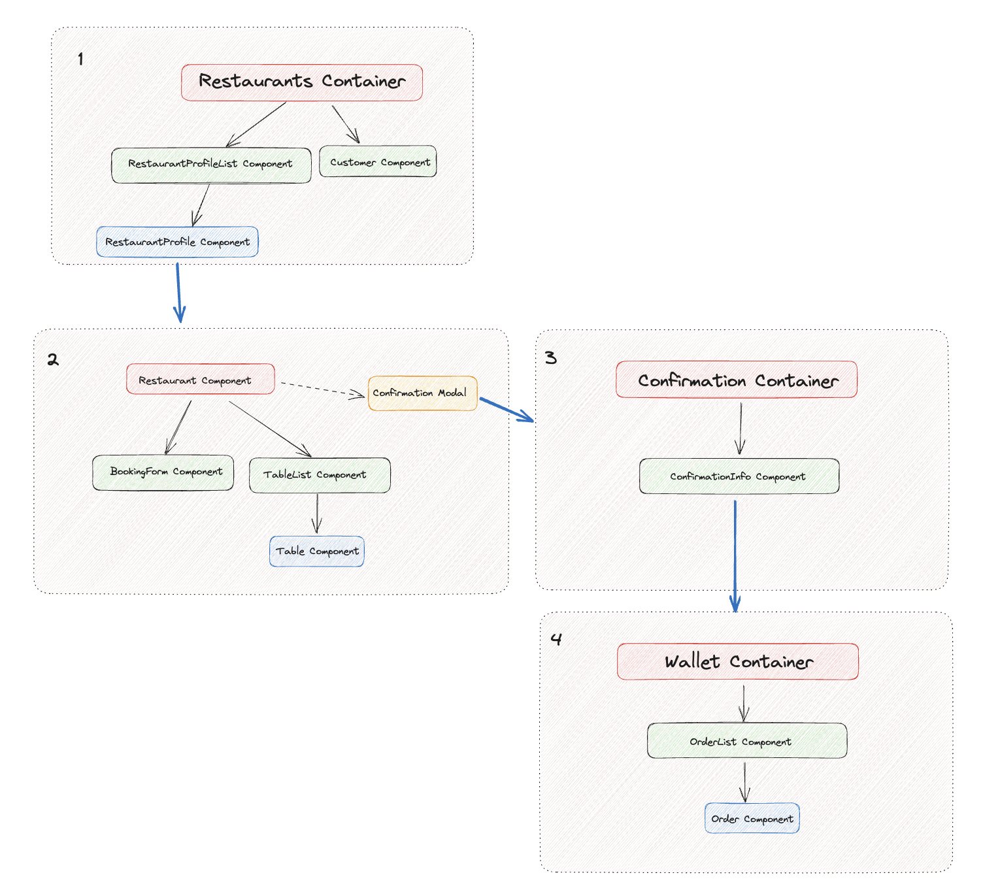

# A RESTAURANT BOOKING APP

### <I>COLLABORATORS: </I>
* Fiona Eshun (GitHub: `Fiona2223` )
* Maryan Axmed (GitHub: `maryan-axmed`)
* Sarah Abdulle (GitHub: `sarahabdulle1`)
* Yasmin Haidar (GitHub: `Yasmin-H` )
* Taliane Moussassa (GitHub: `TalianeM`)

### TABLE OF CONTENTS:

* Project Overview
* Project Aim
* Installation Guide
* Diagrams
* Challenges
* Future

## Project Overview 

We collaborated to create the backend of a restaurant booking app that enables a user to book tables at a restaurant of their choice.

Our MVP was to enable a customer to book a table at multiple restaurants and filtering the locations of restaurants by their city. 

## Project Aims

The aim of this project was to make it easier and more convenient for customers to book tables at a restaurant. The team's goal was to create an impactful project which would be reflected within the community.

## Installation Guide

### Server Side API instructions
The server side api can be found here:
https://github.com/maryan-axmed/RestaurantBookingApp_BackEnd

* Software needed to run the API: 
	* IntelliJ and Java (version 17)
	* Postman
	* Postico
	* PostgreSQL

* Installation instructions:
	* Git clone from the server side API Repo
	* Create an SQL database  and name it `restaurant_booker_db` so that it matches with the name in the `application.properties` file (src of server side API)
	* Once your database has been created, run the `` file in IntelliJ to get started.
	* You can set up your tests using Postman on `localhost:8080/{extension}` or type in `localhost:8080/bookings` in your browser, for example, to see the  data. More details can be found from the backend repo
	

## Client-side Instructions 
The client-side server can be obtained with the following information:

* Ensure that the following software	has been downloaded:
   * Visual Studio Code

* Libraries installation
    * npm i (installs basic node libraries)
    * npm install --save react-modal 
    * npm install --save @react-google-maps/api
    * npm install react-date-picker
    * npm install react-time-picker

### Routes 
To navigate between pages on the React app, we configured the following routes using the React Router:

* Landing Page : `localhost:8080`
* Booking Page : `localhost:8080/bookings`
* Comfirmation Page : `localhost:8080/confirmation`
* Wallet Page : `localhost:8080/wallet`

## DIAGRAMS

### Component Diagram

## Challenges
* Implementing date and time functionality: we struggled with changing the format of the time and date into a format that the back-end would accept. 

## Future
* Adding restaurant address to the database for it to accessible by google map external api
* We would scale by creating a restaurant server side to enable individual restaurant to added their restaurant to the database and access table bookings
* User login and saving their personal contact details

